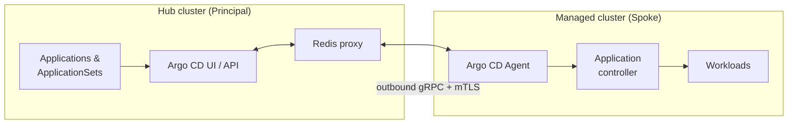
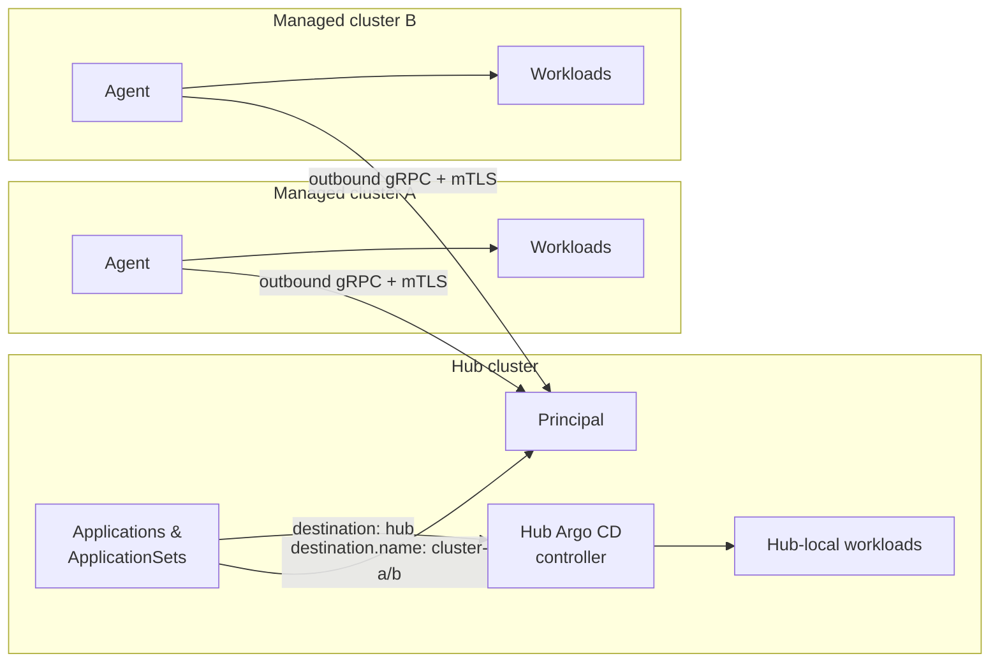

# Scaling GitOps with the Argo CD Agent: Managed and Hybrid Mode in Red Hat Advanced Cluster Management
 
*How a pull-based, agent-driven architecture lets you run GitOps across thousands of clusters without giving up central control, and how Hybrid Mode lets the hub deploy to itself too.*
 
---
 
## TL;DR
 
- With **Red Hat Advanced Cluster Management (ACM)** and **OpenShift GitOps**, the **Argo CD Agent** is generally available.
- The agent moves reconciliation to the workload clusters while keeping a single control point and a single UI on the hub.
- In **Managed Mode**, you author `Application` and `ApplicationSet` resources on the hub (the *Principal*), and agents on the managed clusters (the *spokes*) pull and apply them.
- In **Hybrid Mode**, you run Managed Mode for your remote clusters *and* keep the hub's own Argo CD controller enabled, so `Application` and `ApplicationSet` resources can also deploy to the hub cluster itself.
- Spokes only make **outbound** connections, all traffic is protected by **mTLS**, and the certificate lifecycle is automated.
- Setup is driven by a `Placement` and a `GitOpsCluster` resource. **The `GitOpsCluster` must never select the hub cluster (`local-cluster`).**
---
 
## 1. Why the push model hits a ceiling
 
For years the standard multi-cluster GitOps pattern was the **push model**: one central Argo CD instance reaches out to every remote cluster and manages it. That works well for dozens of clusters. At thousands, the cracks show:
 
| Challenge | What happens in the push model |
|---|---|
| **Connections** | The hub keeps persistent connections to every remote cluster. |
| **Resource load** | The hub watches and caches resources across the whole fleet, so CPU and memory grow with fleet size. |
| **Credentials** | The hub stores access credentials for every managed cluster. |
| **Blast radius** | Compromising the hub can mean access to every cluster. |
| **Networking** | The hub must be able to reach every spoke, which is painful with firewalls, NAT, or edge links. |
 
The Argo CD Agent takes a different approach. Reconciliation happens **on the workload cluster**, and a bi-directional streaming connection back to the hub preserves the central view. You get the scalability and security of a pull architecture *and* the single pane of glass that enterprises expect.
 
---
 
## 2. Choosing a mode: Managed, Autonomous or Hybrid
 
The agent supports different operating modes. The deciding question is: **where does the source of truth for your application definitions live, and where do your apps need to run?**
 
| Dimension | Managed Mode | Autonomous Mode | Hybrid Mode |
|---|---|---|---|
| **Where apps are authored** | Hub cluster (Principal) | Workload cluster (spoke) | Hub cluster (Principal) |
| **Who controls the Application spec** | The hub, fully | The spoke; the hub copy is read-only and any change is reverted | The hub, fully |
| **Where apps can deploy** | Managed clusters only | The spoke itself | Managed clusters **and** the hub cluster |
| **Hub Argo CD controller** | Not needed for workloads | Not needed for workloads | **Enabled**, for hub-local apps |
| **Routing** | Destination-based mapping from hub to agent | Local-only reconciliation | Destination-based mapping to agents; hub-local apps handled by the hub controller |
| **Typical use case** | Centralized GitOps control and policy enforcement | Decentralized or air-gapped environments needing local autonomy | Central control for the fleet *plus* GitOps for hub-hosted components |
 
> **Architect's note:** Managed and Hybrid Mode are a strong fit for compliance-driven environments (for example SOC 2 or ISO 27001) where the hub should be the single, guarded authority for what gets deployed. In Autonomous Mode the opposite holds: if someone edits an `Application` through the hub UI or CLI, the change is automatically reverted to match the agent's local state, so the spoke stays the true master.
 
### How this differs from the "basic" pull model
 
ACM also offers a lighter-weight pull approach based purely on `ManifestWork`. The Argo CD Agent is the **advanced** option: it supports full resource trees in the Argo CD UI and live-state comparison, which a ManifestWork-only approach does not provide.
 
---
 
## 3. How Managed Mode works
 
Managed Mode combines centralized authoring with distributed execution. Four building blocks make it work:
 
### 3.1 Centralized authoring
`Application` and `ApplicationSet` resources are created on the **Principal** (the hub). The hub is the single entry point for configuration and the single place where you review and audit changes.
 
### 3.2 Agent-initiated gRPC streaming
The agent on each spoke opens a **bi-directional gRPC connection** to the Principal. Because the connection is outbound-only from the spoke:
 
- Workload clusters need **no inbound ports** or ingress rules.
- The hub does **not store credentials** for managed clusters.
- The hub does not need to know the network topology of the spokes.
### 3.3 Local reconciliation
The Argo CD application controller **on the managed cluster** performs the actual deployment. This also makes the design resilient: if the connection to the hub drops, the spoke keeps running and continues reconciling against its last known state. This matters for edge and unreliable networks.
 
### 3.4 Live feedback through the Redis proxy
To keep the central UI responsive without caching every resource in the fleet, the Principal uses a **Redis proxy**:
 
- Non-agent keys, such as cluster metadata, are served from the hub.
- Agent-specific keys, such as `app|resources-tree|*` and `app|managed-resources|*`, are routed directly to the relevant agent.
The result is a hub UI that shows live state and resource trees while the hub carries only a fraction of the data it would hold in a push model.
 

 
---
 
## 4. Hybrid Mode: one control plane for the fleet and the hub
 
Managed Mode is designed to push work out to remote clusters. But real hubs are rarely empty. They host their own platform components, such as operators, policies, configuration and shared services, and you probably want to manage those with GitOps as well.
 
**Hybrid Mode** covers both cases on the same hub:
 
- **Remote clusters** run the agent in `managed` mode and are targeted by name through destination-based mapping.
- **The hub cluster** keeps its regular Argo CD application controller enabled, so `Application` and `ApplicationSet` resources can also target the hub itself.
In other words, `ApplicationSet`s can also be deployed on the hub cluster, not only on the fleet.
 

 
### The one rule: never select the hub in `GitOpsCluster`
 
The `GitOpsCluster` (through its `Placement`) must **only** select remote managed clusters. It must **not** point to the hub cluster (`local-cluster`).
 
The reason is the division of labor. The agent is installed only on the clusters the `GitOpsCluster` selects. The hub already has its own Argo CD controller for hub-local apps, so installing an agent there would create a second, competing path to the same cluster. Keep the two paths separate:
 
| Target | Handled by | Selected via |
|---|---|---|
| Remote managed clusters | Agent (managed mode) | `Placement` referenced by `GitOpsCluster` |
| Hub cluster | Hub Argo CD controller | Regular `Application` destination for the hub; **not** in the `GitOpsCluster` placement |
 
### What to configure for Hybrid Mode
 
**1. A Placement that excludes the hub.** Select the remote clusters by label and explicitly exclude `local-cluster`:
 
```yaml
apiVersion: cluster.open-cluster-management.io/v1beta1
kind: Placement
metadata:
  name: argocd-agent-hybrid
  namespace: openshift-gitops
spec:
  predicates:
    - requiredClusterSelector:
        labelSelector:
          matchLabels:
            argocd-agent.rhacm.io/setup: hybrid
          matchExpressions:
            - key: local-cluster
              operator: NotIn
              values:
                - "true"
```
 
**2. A GitOpsCluster in managed mode that references that Placement:**
 
```yaml
apiVersion: apps.open-cluster-management.io/v1beta1
kind: GitOpsCluster
metadata:
  name: gitops-agent-hybrid
  namespace: openshift-gitops
spec:
  argoServer:
    argoNamespace: openshift-gitops
  placementRef:
    kind: Placement
    apiVersion: cluster.open-cluster-management.io/v1beta1
    name: argocd-agent-hybrid
    namespace: openshift-gitops
  gitopsAddon:
    enabled: true
    overrideExistingConfigs: true
  argoCDAgent:
    enabled: true
    mode: managed
    propagateHubCA: true
```
 
**3. An ArgoCD instance on the hub with both the controller and the principal enabled:**
 
```yaml
apiVersion: argoproj.io/v1beta1
kind: ArgoCD
metadata:
  name: openshift-gitops
  namespace: openshift-gitops
spec:
  controller:
    enabled: true            # hub-local apps are reconciled by the hub controller
  sourceNamespaces:
    - '*'
  argoCDAgent:
    principal:
      enabled: true
      destinationBasedMapping: true
      namespace:
        allowedNamespaces:
          - '*'
      server:
        route:
          enabled: true
```
 
Two details deserve attention:
 
- **`controller.enabled: true`** is what makes Hybrid Mode "hybrid". Without it, the hub has no controller to deploy hub-local applications.
- **`destinationBasedMapping: true`** means your `ApplicationSet`s address remote clusters through `destination.name`, which routes each application to the right agent.
**4. Permissions and project settings.** Because the hub controller deploys to the hub, its service account needs sufficient RBAC on the hub (the reference setup grants it `cluster-admin`; scope this down to what your hub-local apps actually need). With destination-based mapping, the `AppProject` used by your apps must also allow the relevant source namespaces and destination names.
 
### Example: one ApplicationSet, hub and fleet
 
A single `ApplicationSet` can fan out to the remote clusters by name while a separate `Application` (or another `ApplicationSet`) targets the hub:
 
```yaml
apiVersion: argoproj.io/v1alpha1
kind: ApplicationSet
metadata:
  name: guestbook-fleet
  namespace: openshift-gitops
spec:
  generators:
    - list:
        elements:
          - cluster: cluster-a
          - cluster: cluster-b
  template:
    metadata:
      name: 'guestbook-{{cluster}}'
    spec:
      project: default
      source:
        repoURL: https://github.com/argoproj/argocd-example-apps
        targetRevision: HEAD
        path: guestbook
      destination:
        name: '{{cluster}}'     # destination-based mapping routes this to the agent
        namespace: guestbook
      syncPolicy:
        automated: {}
```
 
For hub-local applications, point the destination at the hub's in-cluster target instead of a managed cluster name.
 
> **Mixed fleets:** Hybrid Mode works with OpenShift and non-OpenShift spokes (for example Kind, EKS, AKS or GKE). On non-OpenShift clusters, do not force `olmSubscription.enabled: true`. That setting is only valid when every selected cluster is OpenShift. Leave it unset so the add-on auto-detects the cluster type, or set it to `false` for mixed or Kubernetes-only fleets.
 
---
 
## 5. Automating the fleet with `GitOpsCluster`
 
ACM automates the agent lifecycle through the **Open Cluster Management (OCM) Addon Framework**. Three resources work together:
 
| Resource | Role |
|---|---|
| **`Placement`** | Selects target clusters dynamically, for example by labels such as `environment: production`. In Hybrid Mode it must exclude the hub. |
| **`GitOpsCluster`** | The control resource. It references the `Placement`, sets the operating mode, and triggers auto-discovery of the Argo CD server address and port. |
| **GitOps add-on** | Uses OCM `ManifestWork` to deliver the agent and the local Argo CD components to each selected spoke. |
 
When a new cluster matches the `Placement`, the agent is rolled out to it automatically. When a cluster stops matching, it falls out of scope. No manual onboarding is required.
 
> **Note:** API versions and field names shown here follow the Hybrid Mode reference setup. Check them against the documentation for your ACM release before applying.
 
---
 
## 6. Security: automated certificate management
 
All communication between the Principal and the agents is encrypted with **mutual TLS (mTLS)**, and the PKI lifecycle is handled for you:
 
1. **Dedicated CA and per-agent certificates.** The `GitOpsCluster` controller manages a dedicated Certificate Authority on the Principal and issues a unique, signed client certificate for each agent.
2. **Secure delivery.** OCM distributes the TLS credentials and connection parameters to the managed clusters via `ManifestWork`.
3. **Version parity.** To avoid authentication failures caused by version mismatches, the controller watches `argoCDAgent.principal.image` on the hub and keeps agents in sync. For testing, you can pin an agent version with the annotation:
```text
   apps.open-cluster-management.io/disable-agent-image-sync=true
```
 
4. **Automatic rotation.** When certificates change, the controller restarts the Principal and agent pods so connectivity continues without manual intervention.
Combined with outbound-only connections and no stored spoke credentials on the hub, this significantly shrinks the attack surface compared with the push model.
 
---
 
## 7. Which mode is right for you?
 
**Choose Managed Mode when:**
 
- You want a single place to define, review, and audit what is deployed across the fleet.
- Compliance requirements call for a guarded central authority.
- The hub is purely a control plane and does not need GitOps for its own components.
**Choose Hybrid Mode when:**
 
- You want everything from Managed Mode *and* GitOps for workloads on the hub itself.
- You want to use `ApplicationSet`s for both the hub and the fleet from one place.
- You can keep the hub out of the `GitOpsCluster` placement and accept running the hub Argo CD controller alongside the principal.
**Consider Autonomous Mode when:**
 
- Clusters must own their application definitions locally.
- You operate in decentralized or air-gapped settings.
---
 
## 8. Conclusion
 
Managed Mode resolves the classic trade-off between scalability and security in multi-cluster GitOps: reconciliation runs where the workloads live, while the hub keeps authoring and observability. Hybrid Mode extends that model so the hub can run its own GitOps workloads through the same set of `Application` and `ApplicationSet` resources, with a clear rule to keep it safe: the `GitOpsCluster` only ever selects remote clusters, never the hub.
 
The design is a particularly good match for edge scenarios, from high-latency satellite links to large retail footprints, where network resilience can't be taken for granted. If a spoke loses contact with the hub, it keeps working.
 
### Next steps
 
- Review the ACM and OpenShift GitOps documentation for the supported configuration of the Argo CD Agent.
- Try Managed or Hybrid Mode on a small, labeled set of clusters using a `Placement` that excludes `local-cluster`.
- Decide per environment whether Managed, Hybrid or Autonomous Mode fits your governance model.
