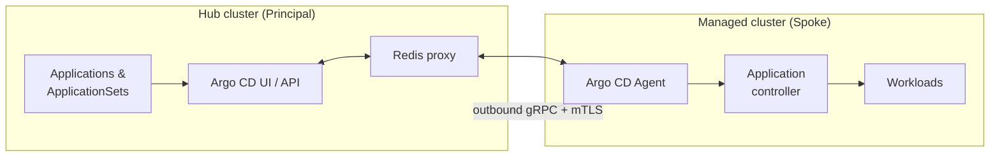

# Scaling GitOps with the Argo CD Agent: Managed Mode in Red Hat Advanced Cluster Management 5.0
 
*How a pull-based, agent-driven architecture lets you run GitOps across thousands of clusters without giving up central control.*
 
---
 
- With **Red Hat Advanced Cluster Management (ACM) 5.0** and **OpenShift GitOps 1.19**, the **Argo CD Agent** is generally available.
- The agent moves reconciliation to the workload clusters while keeping a single control point and a single UI on the hub.
- In **Managed Mode**, you author `Application` and `ApplicationSet` resources on the hub (the *Principal*), and agents on the managed clusters (the *spokes*) pull and apply them.
- Spokes only make **outbound** connections, all traffic is protected by **mTLS**, and the certificate lifecycle is fully automated.
- Setup is driven by a `Placement` and a `GitOpsCluster` resource, with the agent rolled out through the OCM Addon Framework.
---
 
## 1. Why the push model hits a ceiling
 
For years the standard multi-cluster GitOps pattern was the **push model**: one central Argo CD instance reaches out to every remote cluster and manages it. That works well for dozens of clusters. At thousands, the cracks show:
 
| Challenge | What happens in the push model |
|---|---|
| **Connections** | The hub keeps persistent connections to every remote cluster. |
| **Resource load** | The hub watches and caches resources across the whole fleet, so CPU and memory grow with fleet size. |
| **Credentials** | The hub stores access credentials for every managed cluster. |
| **Blast radius** | Compromising the hub can mean access to every cluster. |
| **Networking** | The hub must be able to reach every spoke, which is painful with firewalls, NAT, or edge links. |
 
The Argo CD Agent takes a different approach. Reconciliation happens **on the workload cluster**, and a bi-directional streaming connection back to the hub preserves the central view. You get the scalability and security of a pull architecture *and* the single pane of glass that enterprises expect.
 
---
 
## 2. Choosing a mode: Managed vs. Autonomous
 
The agent supports two operating modes. The deciding question is simple: **where does the source of truth for your application definitions live?**
 
| Dimension | Managed Mode | Autonomous Mode |
|---|---|---|
| **Where apps are authored** | Hub cluster (Principal) | Workload cluster (spoke) |
| **Who controls the Application spec** | The hub, fully | The spoke; the hub copy is read-only and any change is reverted |
| **Routing** | Destination-based mapping from hub to agent | Local-only reconciliation |
| **Typical use case** | Centralized GitOps control and policy enforcement | Decentralized or air-gapped environments needing local autonomy |
 
> **Architect's note:** Managed Mode is a strong fit for compliance-driven environments (for example SOC 2 or ISO 27001) where the hub should be the single, guarded authority for what gets deployed. In Autonomous Mode the opposite holds: if someone edits an `Application` through the hub UI or CLI, the change is automatically reverted to match the agent's local state, so the spoke stays the true master.
 
### How this differs from the "basic" pull model
 
ACM also offers a lighter-weight pull approach based purely on `ManifestWork`. The Argo CD Agent is the **advanced** option: it supports full resource trees in the Argo CD UI and live-state comparison, which a ManifestWork-only approach does not provide.
 
---
 
## 3. How Managed Mode works
 
Managed Mode combines centralized authoring with distributed execution. Four building blocks make it work:
 
### 3.1 Centralized authoring
`Application` and `ApplicationSet` resources are created on the **Principal** (the hub). The hub is the single entry point for configuration and the single place where you review and audit changes.
 
### 3.2 Agent-initiated gRPC streaming
The agent on each spoke opens a **bi-directional gRPC connection** to the Principal. Because the connection is outbound-only from the spoke:
 
- Workload clusters need **no inbound ports** or ingress rules.
- The hub does **not store credentials** for managed clusters.
- The hub does not need to know the network topology of the spokes.
### 3.3 Local reconciliation
The Argo CD application controller **on the managed cluster** performs the actual deployment. This also makes the design resilient: if the connection to the hub drops, the spoke keeps running and continues reconciling against its last known state. This matters for edge and unreliable networks.
 
### 3.4 Live feedback through the Redis proxy
To keep the central UI responsive without caching every resource in the fleet, the Principal uses a **Redis proxy**:
 
- Non-agent keys, such as cluster metadata, are served from the hub.
- Agent-specific keys, such as `app|resources-tree|*` and `app|managed-resources|*`, are routed directly to the relevant agent.
The result is a hub UI that shows live state and resource trees while the hub carries only a fraction of the data it would hold in a push model.
 

 
---
 
## 4. Automating the fleet with `GitOpsCluster`
 
ACM 5.0 automates the agent lifecycle through the **Open Cluster Management (OCM) Addon Framework**. Three resources work together:
 
| Resource | Role |
|---|---|
| **`Placement`** | Selects target clusters dynamically, for example by labels such as `environment: production`. |
| **`GitOpsCluster`** | The control resource. It references the `Placement`, sets the operating mode, and triggers auto-discovery of the Argo CD server address and port. |
| **`argocd-agent-addon`** | Uses OCM `ManifestWork` to deliver the agent and the local Argo CD components to each selected spoke. |
 
### Example: Managed Mode for a production fleet
 
```yaml
apiVersion: apps.open-cluster-management.io/v1alpha1
kind: GitOpsCluster
metadata:
  name: prod-gitops-fleet
  namespace: open-cluster-management
spec:
  placementRef:
    kind: Placement
    name: regional-clusters-placement
  argoCDAgentAddon:
    mode: managed
```
 
When a new cluster matches the `Placement`, the agent is rolled out to it automatically. When a cluster stops matching, it falls out of scope. No manual onboarding is required.
 
> **Note:** Check the exact API version and field names against the ACM 5.0 documentation for your release before applying this example.
 
---
 
## 5. Security: automated certificate management
 
All communication between the Principal and the agents is encrypted with **mutual TLS (mTLS)**, and the PKI lifecycle is handled for you:
 
1. **Dedicated CA and per-agent certificates.** The `GitOpsCluster` controller manages a dedicated Certificate Authority on the Principal and issues a unique, signed client certificate for each agent.
2. **Secure delivery.** OCM distributes the TLS credentials and connection parameters to the managed clusters via `ManifestWork`.
3. **Version parity.** To avoid authentication failures caused by version mismatches, the controller watches `argoCDAgent.principal.image` on the hub and keeps agents in sync. For testing, you can pin an agent version with the annotation:
```text
   apps.open-cluster-management.io/disable-agent-image-sync=true
```
 
4. **Automatic rotation.** When certificates change, the controller restarts the Principal and agent pods so connectivity continues without manual intervention.
Combined with outbound-only connections and no stored spoke credentials on the hub, this significantly shrinks the attack surface compared with the push model.
 
---
 
## 6. Is Managed Mode right for you?
 
**Choose Managed Mode when:**
 
- You want a single place to define, review, and audit what is deployed across the fleet.
- Compliance requirements call for a guarded central authority.
- You manage large fleets and want to cut hub resource consumption.
- Your spokes sit behind firewalls or NAT, or reach the hub over unreliable links.
**Consider Autonomous Mode when:**
 
- Clusters must own their application definitions locally.
- You operate in decentralized or air-gapped settings.
---
 
## 7. Conclusion
 
Managed Mode resolves the classic trade-off between scalability and security in multi-cluster GitOps. Reconciliation runs where the workloads live, the hub keeps authoring and observability, and the whole thing is wired up through `Placement` and `GitOpsCluster`, with certificates managed automatically.
 
The design is a particularly good match for edge scenarios, from high-latency satellite links to large retail footprints, where network resilience can't be taken for granted. If a spoke loses contact with the hub, it keeps working.
 
### Next steps
 
- Review the ACM 5.0 and OpenShift GitOps 1.19 documentation for the supported configuration of the Argo CD Agent.
- Try Managed Mode on a small, labeled set of clusters using a `Placement`.
- Decide per environment whether Managed or Autonomous Mode fits your governance model.
 
